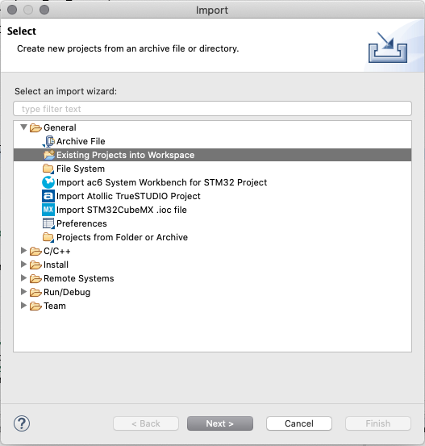
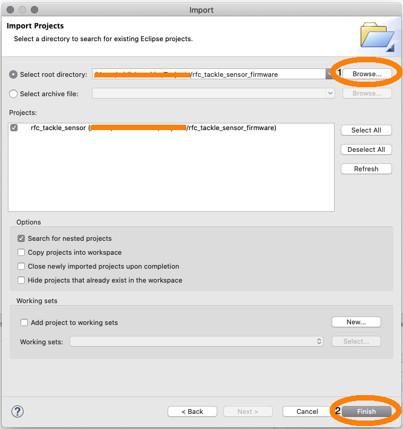
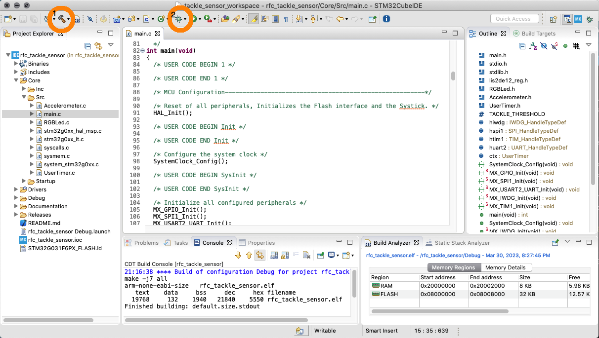

# Collegiate Robotic Football Tackle Sensor Firmware

## Release Notes

| Version | Link to Download Binary | Date | Comments |
| ------- | ----------------------- | ---- | -------- |
| v0.0.0  | [v0.0.0](Releases/v0.0.0/rfc_tackle_sensor_v0.0.0.bin) | 03/30/2023 | Initial firmware release. 200 Hz sampling frequency, 8g max acceleration, 1.450g trigger threshold. |

## Cloning the Repo

Open a git bash terminal in the directory of your choosing and call the following command:

`git clone https://github.com/ehunck/rfc_tackle_sensor_firmware`

## Building and Developing in STM32CubeIDE

Download the STM32CubeIDE available on their [website](https://www.st.com/en/development-tools/stm32cubeide.html).  Follow all instructions for the default installation.

- Launch the CubeIDE application.
- Select a directory to use as your workspace. You can use the default or select a directory of your choosing.  Press Launch. 
- Import the project that you downloaded or cloned into the workspace
- 
- Navigate to the project and import.
- 
- The project can be built by clicking the hammer (1).
- The project can be debugged by clikcing the bug (2).
- 
- The device needs to be powered and connected to be debugged or flashed.
- Either a SEGGER Jlink or an STLink can be used to connect to the MCU.
- 
